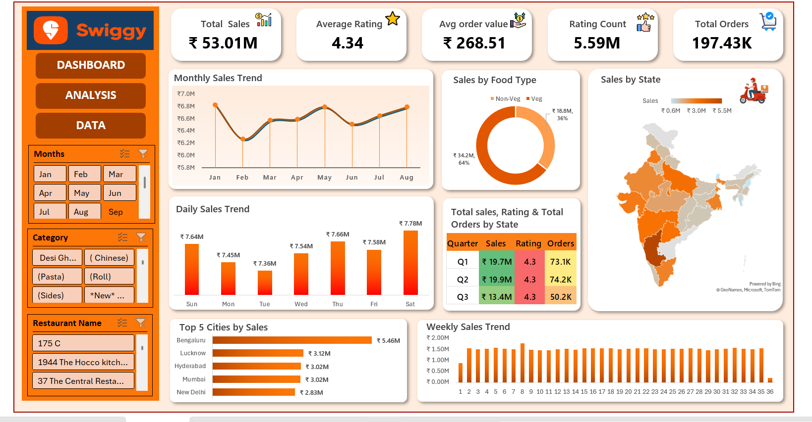

# Swiggy Sales & Orders Dashboard – Excel

## 📊 Project Overview

An interactive Excel dashboard developed to analyze Swiggy sales and order data. The dashboard provides insights into sales performance, orders, ratings, food types, cities, states, and monthly, weekly, and daily sales trends.

## 🛠️ Tools & Technologies

- Microsoft Excel
- Pivot Tables
- Pivot Charts
- Slicers
- Advanced Excel
- Data Analysis
- Data Visualization

## 📈 Dashboard Features

- Total Sales
- Average Rating
- Average Order Value
- Rating Count
- Total Orders
- Monthly Sales Trend
- Weekly Sales Trend
- Daily Sales Trend
- Sales by Food Type
- State-wise Sales Analysis
- Top 5 Cities by Sales

## 📷 Dashboard Preview

## 🎯 Skills Demonstrated

- Data Analysis
- Data Visualization
- Excel Dashboard Development
- Pivot Table & Pivot Chart Analysis
- Interactive Slicer Implementation
